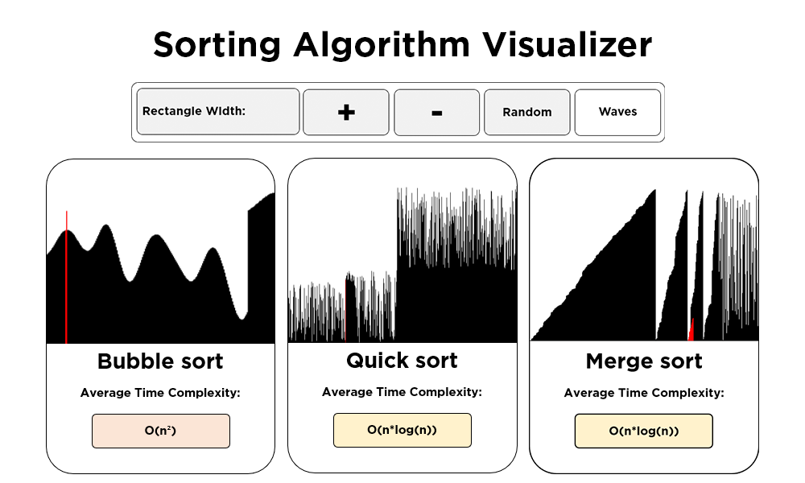
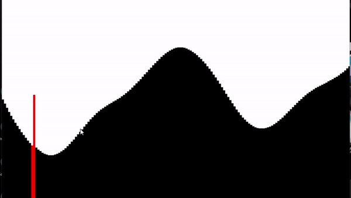
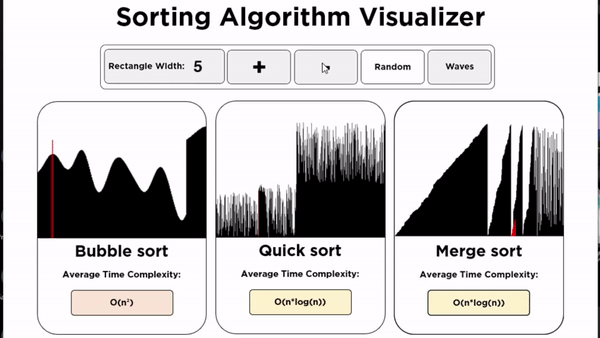

# Sorting Algorithm Visualizer
 My python code that visualizes the bubble sort, quick sort and Merge sort algorithms using Python's Pygame module. Also has an option to randomize the visualizing bars using opensimplex algorithm.

## Bubble Sort
 Bubble Sort is the simplest sorting algorithm that works by repeatedly swapping the adjacent elements if they are in wrong order.

## Quicksort
 QuickSort is a Divide and Conquer algorithm. It picks an element as pivot and partitions the given array around the picked pivot. There are many different versions of quickSort that pick pivot in different ways.

 1. Always pick first element as pivot.
 1. Always pick last element as pivot (implemented in code)
 1. Pick a random element as pivot.
 1. Pick median as pivot.

 The key process in quickSort is partition(). Target of partitions is, given an array and an element x of array as pivot, put x at its correct position in sorted array and put all smaller elements (smaller than x) before x, and put all greater elements (greater than x) after x. All this should be done in linear time.

## Mergesort
 Mergesort is also a Divide and Conquer algorithm. It divides the input array into two halves, calls itself for the two halves, and then merges the two sorted halves. The merge() function is used for merging two halves. The merge(arr, l, m, r) is a key process that assumes that arr[l..m] and arr[m+1..r] are sorted and merges the two sorted sub-arrays into one.

